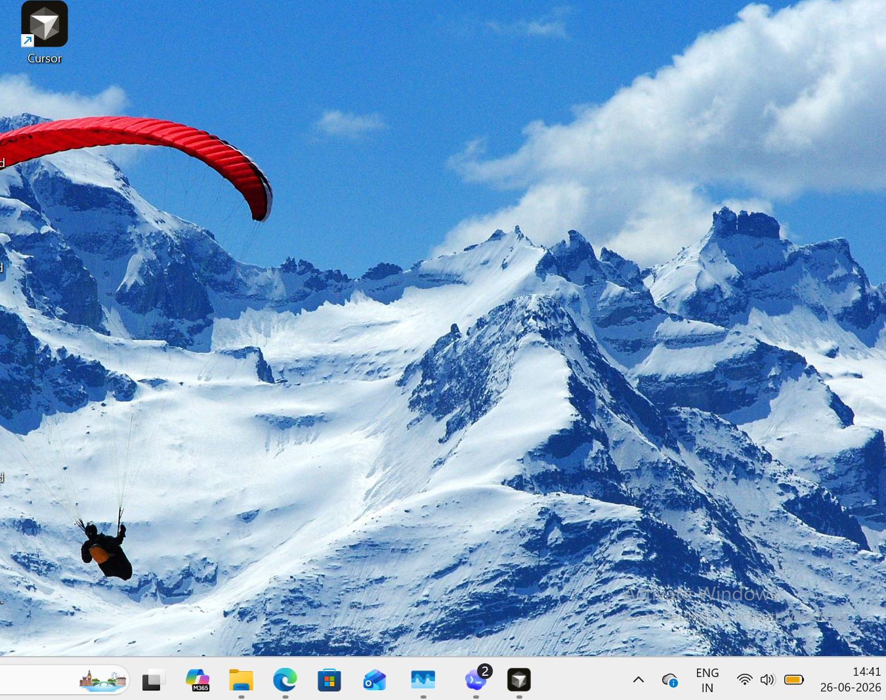
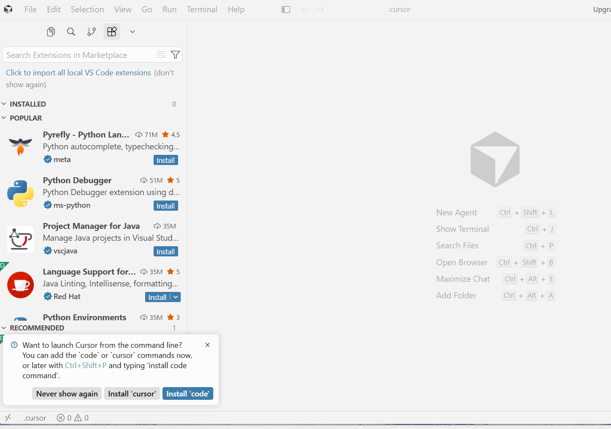
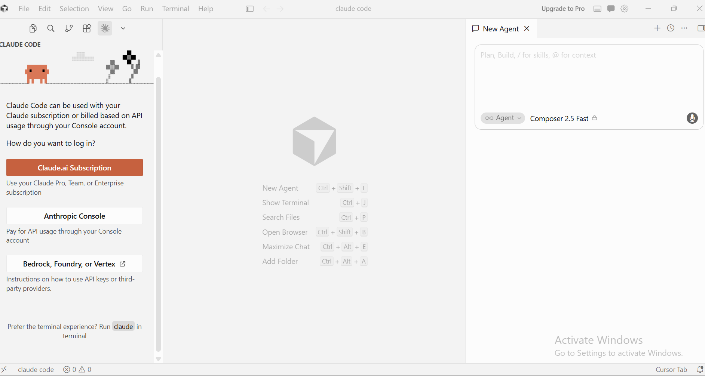
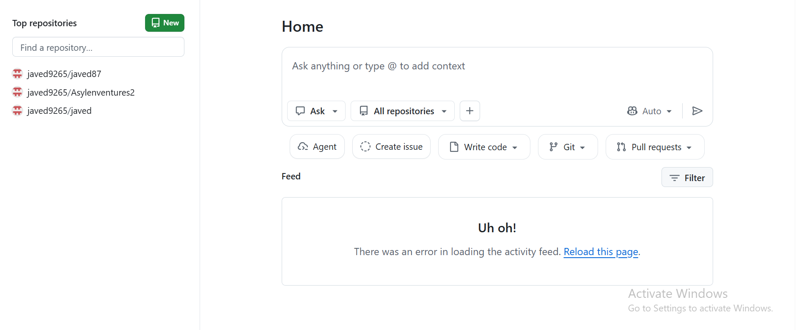
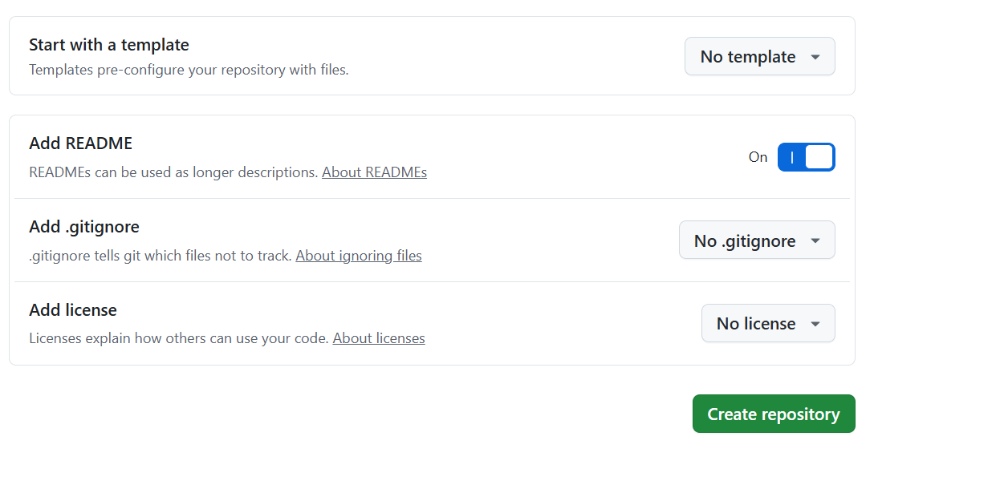
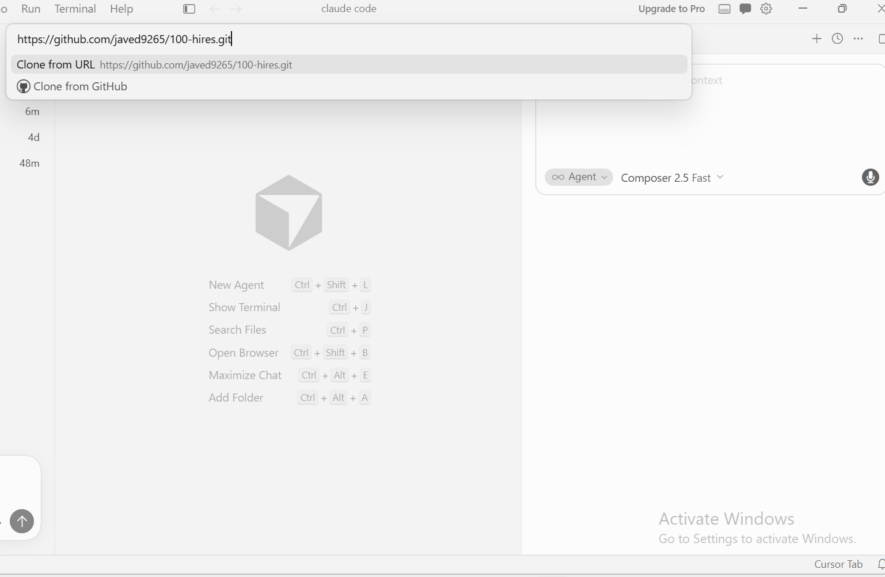
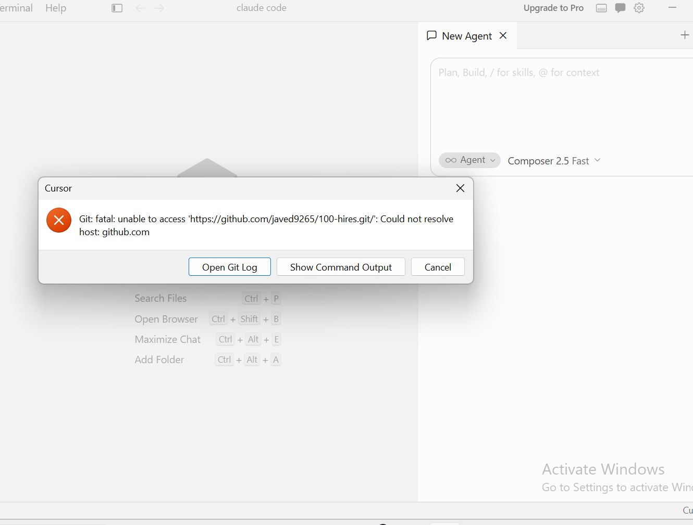
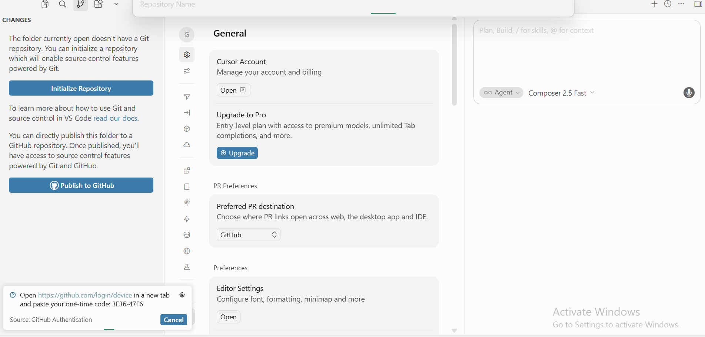
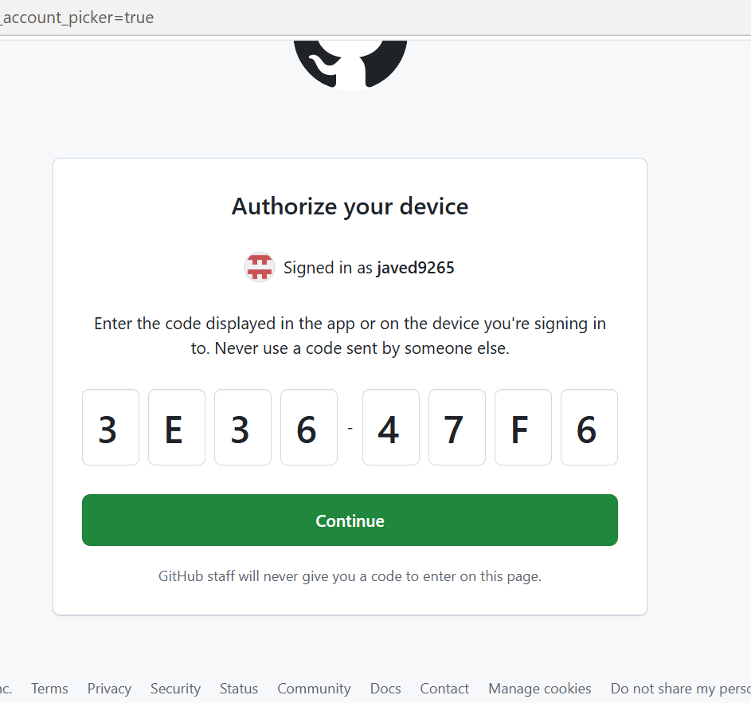
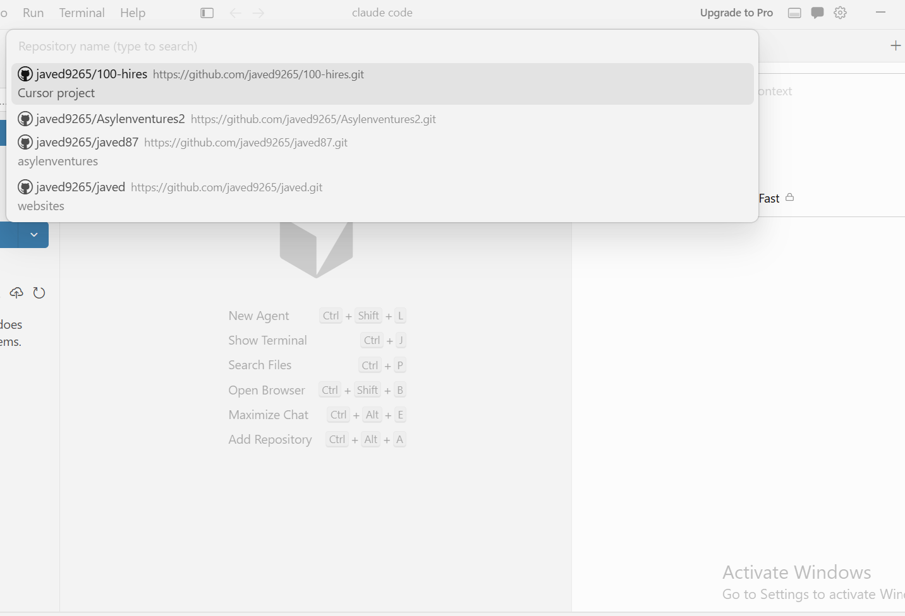

# 100 Hires

This repository documents my first setup journey with Cursor, Claude Code, Codex, and GitHub. I wrote it like a simple learning log so the full process is clear: what I installed, what steps I completed, what issues came up, and how I solved them.

## Current Research Project

I am now building a research project on this topic:

**Cold outreach pipeline for B2B SaaS**

I chose this topic because it connects directly to B2B sales, prospecting, CRM follow-up, customer research, cold email, cold calling, and pipeline generation. The goal is to collect high-signal material from real practitioners so the research can later support a practical cold outreach playbook.

### What I Collected So Far

- 10 selected experts who actively teach or practice cold outreach, outbound sales, cold email, cold calling, deliverability, or pipeline building.
- YouTube transcript-derived notes collected with the Supadata transcript API through a local Codex script.
- 20 public LinkedIn post notes collected with a Codex scraping script where the posts were publicly accessible.
- Latest visible LinkedIn post audits for all 10 experts, collected after signing into LinkedIn and reviewing each expert's recent activity page.
- Source links, date signals, collection method, short excerpts, and practical research notes.

### Research Structure

- `research/sources.md`: selected experts, links, dates, annotations, and collection notes.
- `research/youtube-transcripts/`: transcript-derived notes organized by expert and video.
- `research/linkedin-posts/`: LinkedIn post notes organized by author.
- `research/other/`: collection method and supporting notes.
- `tools/`: local scripts used for transcript and LinkedIn collection.

### Collection Method

For YouTube, I used Codex with a local Python script and the Supadata YouTube transcript API. For LinkedIn, I used public HTML scraping where possible, then reviewed the experts' recent activity pages through a logged-in LinkedIn browser session to verify latest visible posts. I did not commit raw third-party transcript dumps; instead I kept source URLs, collection method, curated notes, date signals, and playbook implications.

The current research folder includes YouTube transcript-derived notes for all 10 selected experts, two topic-relevant LinkedIn post notes for each expert, and a latest-visible-post audit for each expert. The latest audit is intentionally transparent: when an expert's newest visible posts were off-topic, I marked that instead of forcing weak material into the playbook.

## 1. Tools I Installed

These are the main tools and extensions I installed or used during the setup:

- **Cursor**: I downloaded and installed Cursor from the official website.
- **Claude Code extension**: I installed Claude Code inside Cursor from the Extensions section.
- **Codex extension**: I installed Codex inside Cursor from the Extensions section.
- **GitHub**: I used my existing GitHub account to create and manage the repository.
- **Google login**: I used Google sign-in for Cursor, Claude Code, and ChatGPT/Codex login.

## 2. Steps I Completed

First, I downloaded Cursor and opened it on my computer. After launching Cursor, I signed in with my Google account.

Next, I opened the Extensions section in Cursor and installed the Claude Code extension. After installing it, I pressed `Ctrl + Shift + P`, searched for the option to open Claude Code in the sidebar, and selected it.

Claude Code asked how I wanted to log in. I chose the Claude.ai subscription option. An external website opened, and I continued with Google to complete the Claude Code login.

After that, I installed the Codex extension from the Extensions section. I opened Codex in the sidebar using `Ctrl + Shift + P`. It opened an external ChatGPT login page, and I signed up using my Google account.

Then I logged in to GitHub. I already had a GitHub account, so I used my existing credentials. On GitHub, I clicked **Create new repository**, named the repository `100-hires`, and created it successfully.

After creating the repository, I tried to clone it inside Cursor. I pressed `Ctrl + Shift + P`, searched for `Git: Clone`, pasted the repository URL, and tried to clone it:

```text
https://github.com/javed9265/100-hires.git
```

The first clone attempt did not work, so I connected my GitHub account directly inside Cursor using the source control/branch icon. Cursor gave me a GitHub device login code, I entered it on GitHub, and authorized the device.

After GitHub was connected properly, I tried cloning again. This time, the repository appeared in Cursor, I selected `javed9265/100-hires`, cloned it successfully, and opened it in a new Cursor window.

Finally, I created and updated this `README.md` file to record the full setup process.

## 3. Issues I Ran Into And How I Solved Them

### Issue 1: GitHub Clone Error

When I first tried to clone the repository by pasting the GitHub URL, Cursor showed this error:

```text
Git: fatal: unable to access 'https://github.com/javed9265/100-hires.git/':
Could not resolve host: github.com
```

I solved this by connecting my GitHub account directly inside Cursor. I clicked the source control/branch icon, followed the GitHub device authorization steps, entered the code on GitHub, and then tried cloning the repository again.

### Issue 2: Opening The Wrong README File

At one point, I opened a README file from the browser download/temp folder instead of the actual cloned repository folder. Because of that, it looked like I was editing the README, but those changes were not connected to my GitHub repository.

I solved this by making sure I edited the `README.md` inside the real `100-hires` project folder that was cloned from GitHub.

### Issue 3: Changes Not Showing On GitHub Immediately

After editing the README locally, I expected the changes to appear on GitHub automatically. Later I understood that GitHub only shows the latest committed and pushed version of the project.

I solved this by learning that I need to commit the local changes first and then push them to GitHub.

## 4. How I Committed And Pushed To GitHub

After finishing the README, I pushed the work to GitHub manually from Cursor.

First, I opened the cloned `100-hires` folder in Cursor. Then I clicked the Source Control icon on the left side, where Cursor showed the changed `README.md` file and the new `screenshots` folder.

I reviewed the changed files once to make sure the README and screenshots were included. After that, I typed a commit message in the message box: **Update README with setup journey and screenshots**.

Then I clicked the **Commit** button. After the commit was created, Cursor showed the option to sync or push the changes. I clicked **Sync Changes** / **Push** so the local commit would be uploaded to my GitHub repository.

Finally, I opened the GitHub repository page again and refreshed it. After refreshing, I could see the updated README content and the screenshots folder in the repository.

## 5. What I Learned

This was my first full flow of installing Cursor, setting up Claude Code and Codex, creating a GitHub repository, cloning it into Cursor, and preparing a README file.

The biggest thing I learned is that creating files locally is not enough. To make them visible on GitHub, I need to commit and push the changes.

## Screenshots

| Step | Screenshot |
| --- | --- |
| Cursor installed on desktop |  |
| Cursor extensions page |  |
| Claude Code login options |  |
| GitHub home page |  |
| Creating the repository |  |
| Trying to clone from URL |  |
| Git clone error |  |
| GitHub authentication prompt in Cursor |  |
| Authorizing the device on GitHub |  |
| Repository found after GitHub connection |  |

